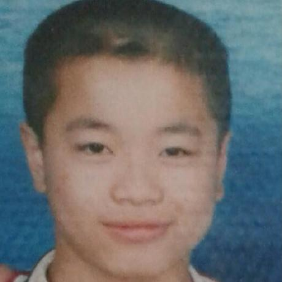
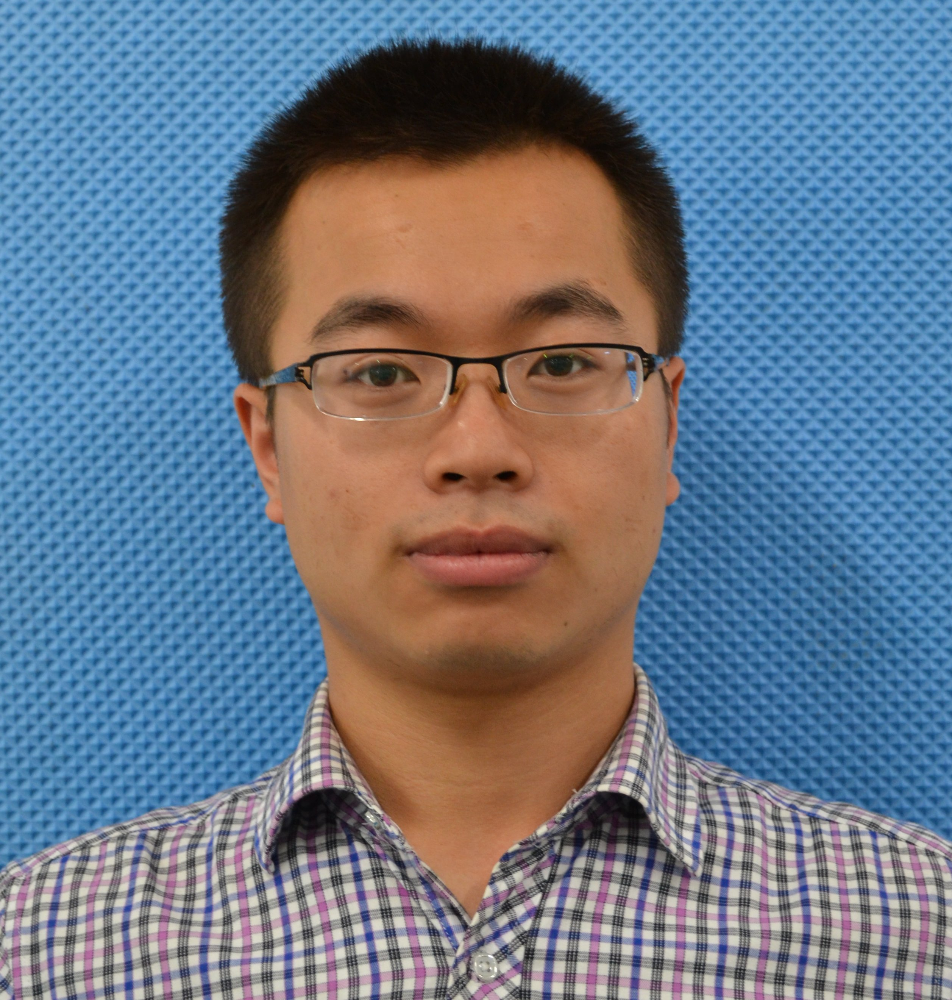

#     
  
### 杨亚军  

----
+ 熟练使用 C++ Java 语言编程
+ 熟练使用 Qt 界面编程， git 版本控制
+ 熟悉 Linux 操作系统/Python
+ 熟悉HTML/SQL/图像处理算法及Android 编程
+ 英语： CET-4/469

----
### 实验室网站
+ 仿生微机器人实验室 : <a href="http://robot.hrbeu.edu.cn/" target="_blank">http://robot.hrbeu.edu.cn/</a>

----
### 我的开源项目
+ 生物图像处理（负责人） : <a href="https://github.com/yajunyang/BioImage" target="_blank">https://github.com/yajunyang/BioImage</a>
+ 基于LeapMotion的碰撞检测（参与学习）：<a href="https://github.com/yajunyang/QtBullet" target="_blank">https://github.com/yajunyang/QtBullet</a>
----
### 与我联系

> #### 微信二维码(鼠标悬停放大)
+ 
> #### 电子邮箱
+ [yyj_93 @ 163.com](http://mail.163.com/)
+ [chinayangyajun@gmail.com](https://mail.google.com/)
+ [programming advice](http://www.javacodegeeks.com/2014/07/step-by-step-path-to-becoming-a-great-software-developer.html)