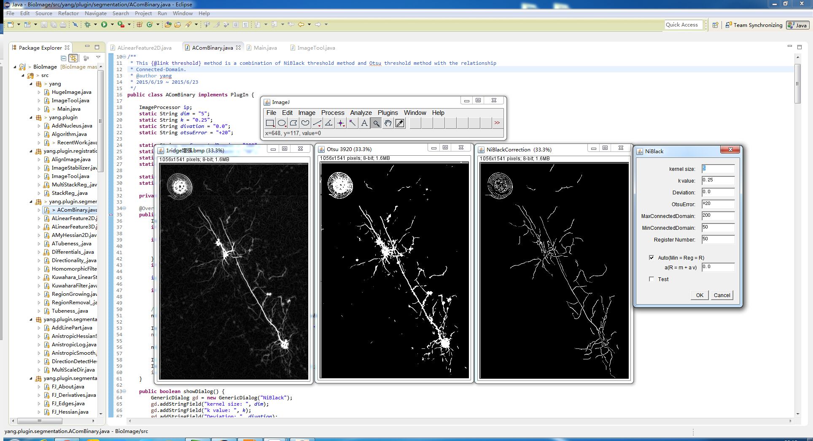
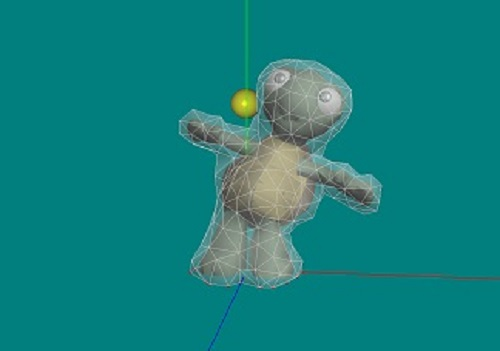
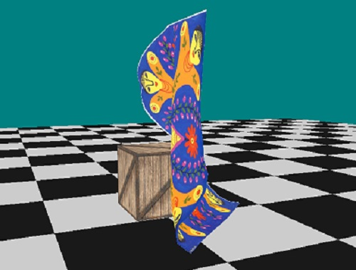
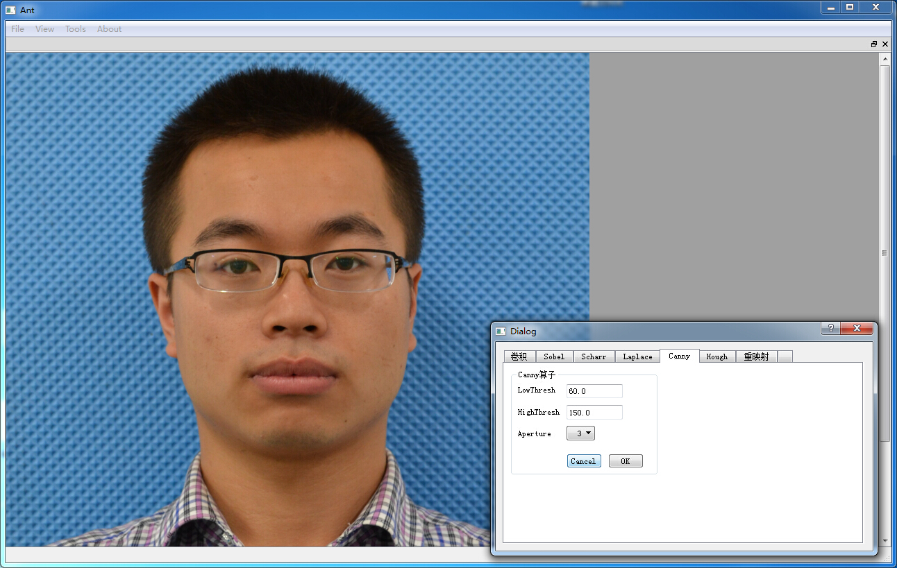
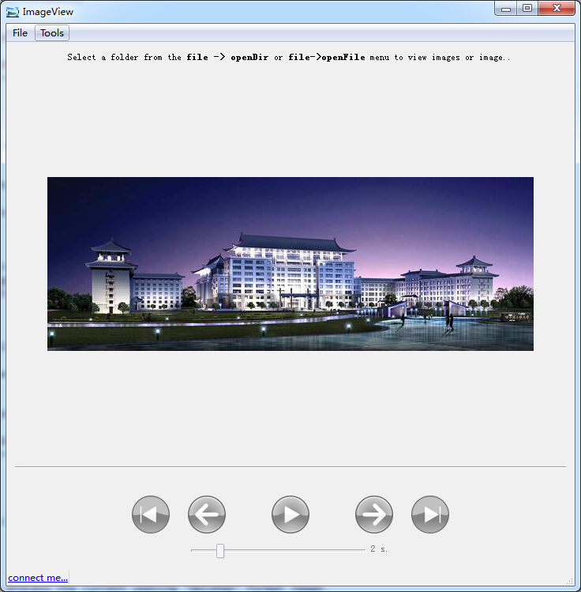

项目经历
=========

[实验室]( http://robot.hrbeu.edu.cn/)主要从事于虚拟现实技术和图像处理工作的研究。

----
### 01. [脑神经图像处理工作研究](https://github.com/yajunyang/BioImage/)
> **项目描述（独立完成）：**[生物图像信息学](https://en.wikipedia.org/wiki/Bioimage_informatics)是一门新兴的科学，是我们实验室在虚拟现实、
声呐图像处理和仿生水下机器鱼研究之后新接入的一项研究课题。我们与国际知名教授[黄昆](http://bmi.osu.edu/~khuang/)合作，专门做一些生物图像处理算法的研究工作。

**项目时间**: 2015/4~2015~7

**个人工作：** 研究超大脑神经图像的配准算法、线形结构的分割算法和神经结构示踪算法。

**最终目的：** 重建脑神经的三维结构

### 02. [基于LeapMotion的物理实时碰撞](https://github.com/yajunyang/QtBullet)
> **项目描述：** 该课题主要利用Qt自带的OpenGL搭建一个图形渲染系统，通过读取三维模型，并生成Bullet碰撞检测可用的软体碰撞检测对象。然后通过实时读取LeapMotion的位置等相关信息，实现刚体球与软体对象进行碰撞检测，最后通过Bullet的实时解算完成模型的形变效果，达到交互游戏设计的目的。

**项目时间：** 2015/3~2015~4

**个人工作（参与学习）：** 掌握了碰撞检测Bullet库的使用方法，学习了一些三维图形学的知识。

### 03. 布料形变仿真
> **项目描述（参与学习）：** 该项目主要利用OpenGL实现布料等柔软织物在重力作用下与刚体对象的碰撞以及变形效果，该系统主要包括柔软织物和刚体等三维模型的加载、基于三角网格碰撞检测模型的匹配，纹理贴图等。通过该系统可进一步用于开发三维虚拟试衣系统。

**项目时间：** 2015/1~2015~3

### 04. [基于OpenCV的图像处理平台界面设计](https://github.com/yajunyang/MainWindow)
> **项目描述（独立完成）：** 该项目主要将Qt优良的界面设计风格和OpenCV图像处理工具包结合起来，将一些通用的图像处理算法（比如Canny边缘检测）以界面的形式呈现出来。

**项目时间：** 2014/9~2014/10

**完成情况：** 该工作以学习Qt和OpenCV为目的，现在回头一看，代码写的很糟糕。

### 05. [基于OpenCV的图像处理平台界面设计](https://github.com/yajunyang/ImgP)
> **项目描述（独立完成）：** 该项目主要将Qt优良的界面设计风格和OpenCV图像处理工具包结合起来，将一些通用的图像处理算法（比如Canny边缘检测）以界面的形式呈现出来。

